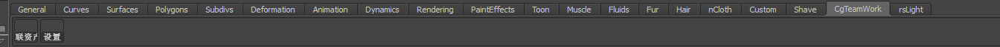
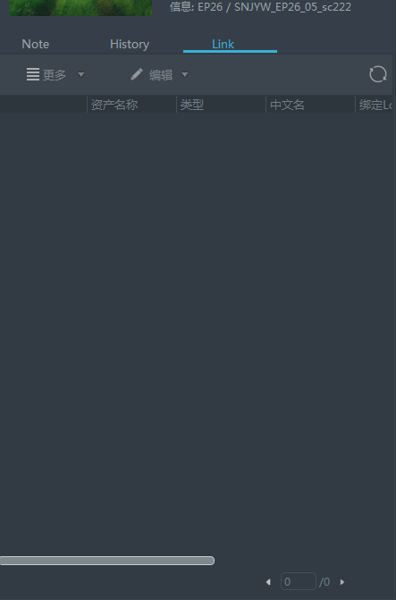
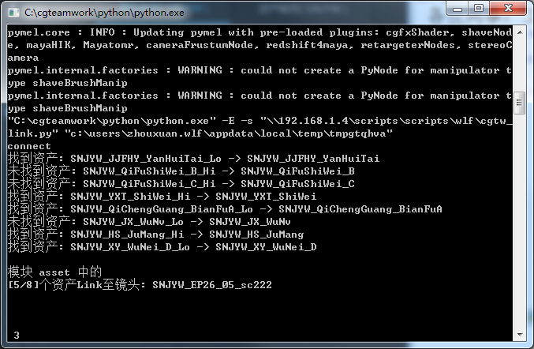
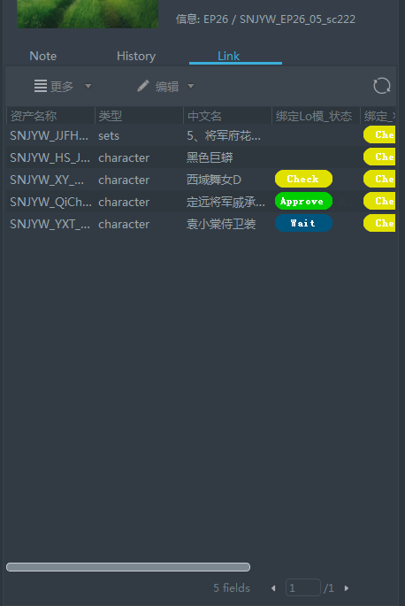
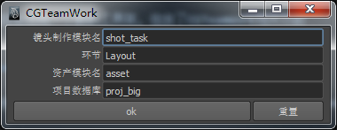

cgteamwork
==========================
包含了CGTeamWork相关功能

启用
------

  安装后在Maya的插件管理器中启用即可

工具架
-----------

  启用后会出现一个新的工具架

.. _联资产:

联资产
************

点击后将读取本工程文件信息, 自动设置当前镜头任务的CGTeamWork资产关联

  运行前

  日志

  运行后

设置
**************

手动设置 :ref:`联资产` 所使用的数据库

